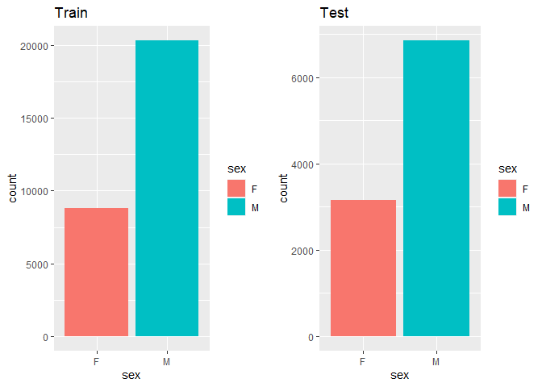

Load libraries   

```r
library(tidyverse)
library(readr)
library(lubridate)
library(gridExtra)
```

Load Data   

```r
train <- read.csv("Train.csv")
test <- read.csv("Test.csv")

#format date
train$join_date <- as_date(train$join_date, format = "%d/%m/%Y")
test$join_date <- as_date(test$join_date, format = "%d/%m/%Y")
```

Format data   

```r
#format categorical variables as factors
#for (i in 9:29){
#    train[,i] <-  factor(as.character(train[,i]), levels = c("0", "1"), labels = c("No", "Yes"))
#}

train$sex <- factor(train$sex)
train$marital_status <- factor(train$marital_status)
train$branch_code <- factor(train$branch_code)
train$occupation_code <- factor(train$occupation_code)
train$occupation_category_code <- factor(train$occupation_category_code)

test$sex <- factor(test$sex)
test$marital_status <- factor(test$marital_status)
test$branch_code <- factor(test$branch_code)
test$occupation_code <- factor(test$occupation_code)
test$occupation_category_code <- factor(test$occupation_category_code)

#examine NAs
colnames(train)[colSums(is.na(train)) > 0]
colnames(test)[colSums(is.na(test)) > 0]

train[is.na(train[,"join_date"]),]
test[is.na(test[,"join_date"]),]
```

```r
#remove rows with NAs for EDA
train <- train[complete.cases(train),]
test <- test[complete.cases(test),]
```

Add feature columns

```r
#Add time elapsed
train$period_client <- 2020 - year(train$join_date)
test$period_client <- 2020 - year(test$join_date)

train$age <- 2020 - train$birth_year
train$join_year <- year(train$join_date)
train$age_join <- train$join_year - train$birth_year

test$age <- 2020 - test$birth_year
test$join_year <- year(test$join_date)
test$age_join <- test$join_year - test$birth_year

#number of products
train$number_products = rowSums(train[,c(which(colnames(train) == "P5DA"): which(colnames(train) == "ECY3"))])
```


Summary Statistics   

```r
#format categorical variables as factors
train_fct <- train
for (i in 9:29){
    train_fct[,i] <-  factor(as.character(train_fct[,i]), levels = c("0", "1"), labels = c("No", "Yes"))
}
summary(train_fct)
```

```
##       ID              join_date          sex       marital_status 
##  Length:29130       Min.   :2010-05-01   F: 8803   M      :22912  
##  Class :character   1st Qu.:2017-07-01   M:20327   S      : 3267  
##  Mode  :character   Median :2018-08-01             U      : 2473  
##                     Mean   :2018-03-01             W      :  301  
##                     3rd Qu.:2019-06-01             D      :  135  
##                     Max.   :2020-08-01             R      :   34  
##                                                    (Other):    8  
##    birth_year    branch_code   occupation_code occupation_category_code
##  Min.   :1932   748L   :8135   2A7I   : 7089   56SI: 3655              
##  1st Qu.:1973   94KC   :3658   0KID   : 3969   90QI: 5552              
##  Median :1980   UAOD   :3507   SST3   : 2711   AHH5:  102              
##  Mean   :1980   E5SW   :3185   UJ5T   : 2079   JD7X:  576              
##  3rd Qu.:1987   30H5   :3151   0OJM   : 1564   L44T:  627              
##  Max.   :2011   XX25   :2805   BPSA   : 1091   T4MS:18618              
##                 (Other):4689   (Other):10627                           
##   P5DA        RIBP       X8NN1       X7POT       X66FJ        GYSR      
##  No :29090   No :27351   No :28973   No :28814   No :28791   No :29126  
##  Yes:   40   Yes: 1779   Yes:  157   Yes:  316   Yes:  339   Yes:    4  
##                                                                         
##                                                                         
##                                                                         
##                                                                         
##                                                                         
##   SOP4        RVSZ        PYUQ        LJR9        N2MW        AHXO      
##  No :28699   No : 3803   No :26957   No :28776   No :28292   No :28591  
##  Yes:  431   Yes:25327   Yes: 2173   Yes:  354   Yes:  838   Yes:  539  
##                                                                         
##                                                                         
##                                                                         
##                                                                         
##                                                                         
##   BSTQ        FM3X        K6QO        QBOL        JWFN        JZ9D      
##  No :28806   No :29020   No : 7502   No :22298   No :28820   No :27705  
##  Yes:  324   Yes:  110   Yes:21628   Yes: 6832   Yes:  310   Yes: 1425  
##                                                                         
##                                                                         
##                                                                         
##                                                                         
##                                                                         
##   J9JW        GHYX        ECY3       period_client        age       
##  No :27712   No :28228   No :28030   Min.   : 0.00   Min.   : 9.00  
##  Yes: 1418   Yes:  902   Yes: 1100   1st Qu.: 1.00   1st Qu.:33.00  
##                                      Median : 2.00   Median :40.00  
##                                      Mean   : 2.28   Mean   :40.48  
##                                      3rd Qu.: 3.00   3rd Qu.:47.00  
##                                      Max.   :10.00   Max.   :88.00  
##                                                                     
##    join_year       age_join    number_products 
##  Min.   :2010   Min.   : 8.0   Min.   : 2.000  
##  1st Qu.:2017   1st Qu.:31.0   1st Qu.: 2.000  
##  Median :2018   Median :38.0   Median : 2.000  
##  Mean   :2018   Mean   :38.2   Mean   : 2.278  
##  3rd Qu.:2019   3rd Qu.:45.0   3rd Qu.: 2.000  
##  Max.   :2020   Max.   :80.0   Max.   :14.000  
## 
```

```r
#format categorical variables as factors
test_fct <- test
for (i in 9:29){
    test_fct[,i] <-  factor(as.character(test_fct[,i]), levels = c("0", "1"), labels = c("No", "Yes"))
}
summary(test_fct)
```

```
##       ID              join_date          sex      marital_status   birth_year  
##  Length:9999        Min.   :2010-05-01   F:3155   M      :7878   Min.   :1933  
##  Class :character   1st Qu.:2017-06-01   M:6844   S      :1116   1st Qu.:1973  
##  Mode  :character   Median :2018-07-01            U      : 842   Median :1980  
##                     Mean   :2018-02-28            W      : 105   Mean   :1980  
##                     3rd Qu.:2019-07-01            D      :  51   3rd Qu.:1987  
##                     Max.   :2020-07-01            R      :   5   Max.   :2001  
##                                                   (Other):   2                 
##   branch_code   occupation_code occupation_category_code  P5DA       RIBP     
##  748L   :2783   2A7I   :2404    56SI:1262                No :9994   No :9699  
##  UAOD   :1207   0KID   :1465    90QI:1927                Yes:   5   Yes: 300  
##  94KC   :1191   SST3   : 943    AHH5:  29                                     
##  30H5   :1114   UJ5T   : 697    JD7X: 191                                     
##  E5SW   :1069   0OJM   : 542    L44T: 208                                     
##  XX25   : 999   BPSA   : 397    T4MS:6382                                     
##  (Other):1636   (Other):3551                                                  
##  X8NN1      X7POT      X66FJ       GYSR       SOP4       RVSZ       PYUQ     
##  No :9963   No :9935   No :9925   No :9998   No :9921   No :5271   No :9534  
##  Yes:  36   Yes:  64   Yes:  74   Yes:   1   Yes:  78   Yes:4728   Yes: 465  
##                                                                              
##                                                                              
##                                                                              
##                                                                              
##                                                                              
##   LJR9       N2MW       AHXO       BSTQ       FM3X       K6QO       QBOL     
##  No :9921   No :9859   No :9899   No :9897   No :9970   No :5975   No :8499  
##  Yes:  78   Yes: 140   Yes: 100   Yes: 102   Yes:  29   Yes:4024   Yes:1500  
##                                                                              
##                                                                              
##                                                                              
##                                                                              
##                                                                              
##   JWFN       JZ9D       J9JW       GHYX       ECY3      period_client   
##  No :9933   No :9679   No :9676   No :9813   No :9766   Min.   : 0.000  
##  Yes:  66   Yes: 320   Yes: 323   Yes: 186   Yes: 233   1st Qu.: 1.000  
##                                                         Median : 2.000  
##                                                         Mean   : 2.283  
##                                                         3rd Qu.: 3.000  
##                                                         Max.   :10.000  
##                                                                         
##       age          join_year       age_join    
##  Min.   :19.00   Min.   :2010   Min.   :17.00  
##  1st Qu.:33.00   1st Qu.:2017   1st Qu.:31.00  
##  Median :40.00   Median :2018   Median :37.00  
##  Mean   :40.31   Mean   :2018   Mean   :38.03  
##  3rd Qu.:47.00   3rd Qu.:2019   3rd Qu.:45.00  
##  Max.   :87.00   Max.   :2020   Max.   :87.00  
## 
```

## Train vs Test
Join Date   

```r
year_train <- as.character(year(train$join_date))
month_train <- month(train$join_date, label = TRUE)
year_month <- paste(month_train, year_train)

p1 <- data.frame(year_month) %>% mutate(year_month = zoo::as.yearmon(year_month, "%b %Y")) %>%
    group_by(year_month) %>% summarise(count = length(year_month)) %>% ggplot(aes(x = year_month, y = count)) + geom_line() + ggtitle("Train")
```

```
## `summarise()` ungrouping output (override with `.groups` argument)
```

```r
year_test <- as.character(year(test$join_date))
month_test <- month(test$join_date, label = TRUE)
year_month_test <- paste(month_test, year_test)

p2 <- data.frame(year_month_test) %>% mutate(year_month = zoo::as.yearmon(year_month_test, "%b %Y")) %>%  group_by(year_month) %>% summarise(count = length(year_month)) %>% ggplot(aes(x = year_month, y = count)) + geom_line() + ggtitle("Test")
```

```
## `summarise()` ungrouping output (override with `.groups` argument)
```

```r
grid.arrange(p1, p2, nrow = 2)
```

<!-- -->

Male vs Female   

```r
p3 <- train %>% ggplot(aes(sex, fill = sex)) + geom_bar() + ggtitle("Train")
p4 <- test %>% ggplot(aes(sex, fill = sex)) + geom_bar() + ggtitle("Test")
grid.arrange(p3, p4, ncol = 2) 
```

<!-- -->
   
Marital Status   

```r
p5 <- train %>% ggplot(aes(marital_status, fill = marital_status)) + geom_bar() + ggtitle("Train")
p6 <- test %>% ggplot(aes(marital_status, fill = marital_status)) + geom_bar() + ggtitle("Test")
grid.arrange(p5, p6, ncol = 2) 
```

<!-- -->
   
Birth Year   

```r
p7 <- train %>% ggplot(aes(birth_year)) + geom_bar() + ggtitle("Train")
p8 <- test %>% ggplot(aes(birth_year)) + geom_bar() + ggtitle("Test") + scale_x_continuous(limits = c(min(train$birth_year), max(train$birth_year)))
grid.arrange(p7, p8, nrow = 2)
```

<!-- -->

Years elapsed since joined   

```r
p13 <- train %>% ggplot(aes(period_client)) + geom_bar() + ggtitle("Train")
p14 <- test %>% ggplot(aes(period_client)) + geom_bar() + ggtitle("Test")
grid.arrange(p13, p14, nrow = 2)
```

<!-- -->
   
Branch Code   

```r
p9 <- train %>% ggplot(aes(branch_code, fill = branch_code)) + geom_bar() + ggtitle("Train") + theme(axis.text.x = element_text(angle = 90))
p10 <- test %>% ggplot(aes(branch_code, fill = branch_code)) + geom_bar() + ggtitle("Test") + theme(axis.text.x = element_text(angle = 90))
grid.arrange(p9, p10, ncol = 2)    
```

<!-- -->
   
Occupation Code Category   

```r
p11 <- train %>% ggplot(aes(occupation_category_code, fill = occupation_category_code)) + geom_bar() + ggtitle("Train")
p12 <- test %>% ggplot(aes(occupation_category_code, fill = occupation_category_code)) + geom_bar() + ggtitle("Test")
grid.arrange(p11, p12, ncol = 2)
```

<!-- -->
## Parameters vs Products
Correlation Matrix   

```r
corr_matrix <- cor(train[,c(5,9:ncol(train))])
corrplot::corrplot(corr_matrix, order = "FPC", method = "circle", type = "lower", tl.cex = 0.6, tl.col = "black")
```

<!-- -->
    
Sex vs Products   

```r
sex_summary <- train %>% group_by(sex) %>% select(P5DA:ECY3) %>% summarise_all(sum)
females <- sex_summary[1,-1] / sum(sex_summary[1,-1])
males <- sex_summary[2,-1] / sum(sex_summary[2,-1])
females <- females %>% mutate(sex = factor("F"))
males <- males %>% mutate(sex = factor("M"))

bind_rows(females, males) %>% pivot_longer(cols= -sex, names_to = "product" , values_to = "proportion") %>% ggplot(aes(x = product, y = proportion, fill = sex)) + geom_col(position = "dodge") + theme(axis.text.x = element_text(angle = 90))
```

<!-- -->
    
Marital Status   

```r
marital_products <- train %>% pivot_longer(cols= P5DA:ECY3, names_to = "product" , values_to = "purchase") %>% group_by(marital_status, product) %>% summarise(total = sum(purchase)) %>% pivot_wider(id_cols = "marital_status" ,names_from = "product", values_from = "total")

marital_products_mat <- apply(marital_products[,-1], MARGIN = 1, function(x) x / sum(x))
marital_products_mat <- data.frame(marital_products_mat)
colnames(marital_products_mat) <- pull(marital_products, marital_status)
marital_products_mat <- rownames_to_column(marital_products_mat, "product")
    
marital_products_mat %>% pivot_longer(cols= D:W, names_to = "marital_status" , values_to = "proportion") %>% ggplot(aes(x = marital_status, y = proportion, fill = product)) + geom_col()
```

<!-- -->


```r
marital_products <- train %>% pivot_longer(cols= P5DA:ECY3, names_to = "product" , values_to = "purchase") %>% group_by(product, marital_status) %>% summarise(total = sum(purchase)) %>% pivot_wider(id_cols = "product" ,names_from = "marital_status", values_from = "total")

marital_products_mat <- apply(marital_products[,-1], MARGIN = 1, function(x) x / sum(x))
marital_products_mat <- data.frame(marital_products_mat)
colnames(marital_products_mat) <- pull(marital_products, product)
marital_products_mat <- rownames_to_column(marital_products_mat, "marital_status")

marital_products_mat %>% pivot_longer(cols= AHXO:X8NN1, names_to = "product" , values_to = "proportion") %>% ggplot(aes(x = product, y = proportion, fill = marital_status)) + geom_col() + theme(axis.text.x = element_text(angle = 90))
```

<!-- -->
   
Birth Year   

```r
birth_year <- train %>% pivot_longer(cols= P5DA:ECY3, names_to = "product" , values_to = "purchase") %>% group_by(birth_year, product) %>% summarise(total = sum(purchase)) %>%  pivot_wider(id_cols = "birth_year" ,names_from = "product", values_from = "total")
```

```
## `summarise()` regrouping output by 'birth_year' (override with `.groups` argument)
```

```r
birth_year <- column_to_rownames(birth_year, var = "birth_year")
birth_year <- apply(birth_year, MARGIN = 1, function(x) x / sum(x))
birth_year %>% knitr::kable()
```

         1932   1936   1938   1946   1947    1948   1950   1951        1952        1953    1954        1955        1956        1957        1958        1959        1960        1961        1962        1963        1964        1965        1966        1967        1968        1969        1970        1971        1972        1973        1974        1975        1976        1977        1978        1979        1980        1981        1982        1983        1984        1985        1986        1987        1988        1989        1990        1991        1992        1993        1994        1995        1996        1997        1998        1999        2000        2001   2002   2005        2011
------  -----  -----  -----  -----  -----  ------  -----  -----  ----------  ----------  ------  ----------  ----------  ----------  ----------  ----------  ----------  ----------  ----------  ----------  ----------  ----------  ----------  ----------  ----------  ----------  ----------  ----------  ----------  ----------  ----------  ----------  ----------  ----------  ----------  ----------  ----------  ----------  ----------  ----------  ----------  ----------  ----------  ----------  ----------  ----------  ----------  ----------  ----------  ----------  ----------  ----------  ----------  ----------  ----------  ----------  ----------  ----------  -----  -----  ----------
AHXO      0.0    0.0    0.0    0.0   0.00   0.125    0.0    0.0   0.0000000   0.0869565   0.100   0.0666667   0.0833333   0.0229008   0.0130293   0.0154867   0.0110701   0.0102669   0.0126582   0.0081301   0.0082192   0.0111386   0.0140581   0.0083276   0.0153657   0.0127907   0.0078288   0.0143229   0.0097948   0.0097403   0.0080250   0.0085389   0.0091283   0.0083026   0.0084034   0.0067783   0.0070039   0.0091864   0.0043526   0.0066597   0.0070771   0.0050125   0.0045137   0.0042644   0.0048031   0.0050297   0.0057803   0.0053086   0.0099770   0.0073327   0.0046382   0.0073439   0.0070053   0.0040733   0.0062893   0.0040650   0.0000000   0.0000000   0.00    0.0   0.0000000
BSTQ      0.0    0.0    0.0    0.0   0.00   0.000    0.0    0.0   0.0000000   0.0000000   0.000   0.0000000   0.0000000   0.0000000   0.0000000   0.0000000   0.0018450   0.0020534   0.0014065   0.0054201   0.0013699   0.0024752   0.0000000   0.0041638   0.0030731   0.0046512   0.0046973   0.0039063   0.0074627   0.0055659   0.0075791   0.0028463   0.0068462   0.0073801   0.0092437   0.0067783   0.0077821   0.0078740   0.0058034   0.0073607   0.0077849   0.0045948   0.0053344   0.0063966   0.0024015   0.0032007   0.0017341   0.0013271   0.0015349   0.0018332   0.0000000   0.0024480   0.0000000   0.0000000   0.0000000   0.0000000   0.0000000   0.0000000   0.00    0.0   0.0000000
ECY3      0.5    0.0    0.0    0.0   0.25   0.000    0.0    0.0   0.0000000   0.0434783   0.025   0.0222222   0.0476190   0.0458015   0.0097720   0.0265487   0.0184502   0.0082136   0.0267229   0.0176152   0.0164384   0.0123762   0.0187441   0.0194310   0.0135218   0.0191860   0.0161795   0.0156250   0.0205224   0.0194805   0.0169416   0.0185009   0.0209950   0.0152214   0.0138655   0.0199362   0.0163424   0.0135608   0.0134204   0.0154224   0.0138004   0.0146199   0.0143619   0.0106610   0.0144092   0.0141747   0.0173410   0.0199071   0.0184190   0.0219982   0.0194805   0.0122399   0.0192644   0.0162933   0.0125786   0.0081301   0.0235294   0.1363636   0.25    0.0   0.0000000
FM3X      0.0    0.0    0.0    0.0   0.00   0.000    0.0    0.0   0.0000000   0.0000000   0.000   0.0000000   0.0000000   0.0000000   0.0000000   0.0000000   0.0000000   0.0000000   0.0000000   0.0040650   0.0013699   0.0012376   0.0000000   0.0006940   0.0006146   0.0005814   0.0026096   0.0026042   0.0027985   0.0023191   0.0040125   0.0014231   0.0041077   0.0032288   0.0042017   0.0011962   0.0023346   0.0026247   0.0014509   0.0021030   0.0024770   0.0012531   0.0016414   0.0008529   0.0000000   0.0000000   0.0000000   0.0006636   0.0000000   0.0009166   0.0009276   0.0000000   0.0000000   0.0000000   0.0000000   0.0000000   0.0000000   0.0000000   0.00    0.0   0.0000000
GHYX      0.0    0.0    0.0    0.0   0.00   0.000    0.0    0.0   0.0000000   0.0000000   0.000   0.0000000   0.0000000   0.0000000   0.0000000   0.0132743   0.0073801   0.0020534   0.0070323   0.0162602   0.0068493   0.0099010   0.0140581   0.0090215   0.0110633   0.0098837   0.0125261   0.0136719   0.0102612   0.0153061   0.0156041   0.0123340   0.0141488   0.0115314   0.0134454   0.0203349   0.0140078   0.0179353   0.0174102   0.0171749   0.0159236   0.0142022   0.0184653   0.0174840   0.0134486   0.0132602   0.0121387   0.0179164   0.0122794   0.0073327   0.0092764   0.0061200   0.0122592   0.0101833   0.0062893   0.0040650   0.0000000   0.0000000   0.00    0.0   0.0000000
GYSR      0.0    0.0    0.0    0.0   0.00   0.000    0.0    0.0   0.0000000   0.0000000   0.000   0.0000000   0.0000000   0.0000000   0.0032573   0.0000000   0.0000000   0.0000000   0.0000000   0.0000000   0.0000000   0.0000000   0.0000000   0.0000000   0.0000000   0.0000000   0.0000000   0.0000000   0.0004664   0.0000000   0.0000000   0.0000000   0.0000000   0.0004613   0.0000000   0.0000000   0.0000000   0.0000000   0.0000000   0.0000000   0.0000000   0.0004177   0.0000000   0.0000000   0.0000000   0.0000000   0.0000000   0.0000000   0.0000000   0.0000000   0.0000000   0.0000000   0.0000000   0.0000000   0.0000000   0.0000000   0.0000000   0.0000000   0.00    0.0   0.0000000
J9JW      0.0    0.0    0.0    0.0   0.00   0.000    0.0    0.0   0.0000000   0.0000000   0.000   0.0000000   0.0000000   0.0000000   0.0000000   0.0000000   0.0036900   0.0061602   0.0042194   0.0094851   0.0041096   0.0173267   0.0093721   0.0159611   0.0135218   0.0116279   0.0140919   0.0156250   0.0177239   0.0194805   0.0209541   0.0189753   0.0196257   0.0285978   0.0285714   0.0271132   0.0291829   0.0279965   0.0275662   0.0290922   0.0350318   0.0300752   0.0299549   0.0311301   0.0244957   0.0260631   0.0202312   0.0185800   0.0168841   0.0100825   0.0148423   0.0097919   0.0052539   0.0040733   0.0094340   0.0000000   0.0117647   0.0000000   0.00    0.0   0.0000000
JWFN      0.0    0.0    0.0    0.0   0.00   0.000    0.0    0.0   0.0000000   0.0000000   0.000   0.0000000   0.0000000   0.0076336   0.0097720   0.0022124   0.0036900   0.0102669   0.0154712   0.0054201   0.0054795   0.0074257   0.0074977   0.0090215   0.0055317   0.0029070   0.0041754   0.0052083   0.0027985   0.0055659   0.0031208   0.0009488   0.0022821   0.0023063   0.0029412   0.0047847   0.0035019   0.0061242   0.0029017   0.0045566   0.0021231   0.0075188   0.0065654   0.0017058   0.0057637   0.0036580   0.0063584   0.0079628   0.0046048   0.0091659   0.0055659   0.0073439   0.0052539   0.0020367   0.0000000   0.0121951   0.0000000   0.0000000   0.00    0.0   0.0000000
JZ9D      0.0    0.0    0.0    0.0   0.00   0.000    0.0    0.0   0.0000000   0.0000000   0.000   0.0000000   0.0000000   0.0000000   0.0000000   0.0022124   0.0036900   0.0061602   0.0042194   0.0094851   0.0041096   0.0173267   0.0093721   0.0166551   0.0135218   0.0122093   0.0140919   0.0156250   0.0177239   0.0194805   0.0209541   0.0189753   0.0200822   0.0285978   0.0285714   0.0271132   0.0295720   0.0279965   0.0275662   0.0290922   0.0357396   0.0300752   0.0299549   0.0311301   0.0244957   0.0260631   0.0202312   0.0185800   0.0168841   0.0100825   0.0148423   0.0097919   0.0052539   0.0040733   0.0094340   0.0000000   0.0117647   0.0000000   0.00    0.0   0.0000000
K6QO      0.0    0.0    0.0    0.0   0.00   0.000    0.0    0.0   0.0000000   0.0000000   0.000   0.0000000   0.0476190   0.1526718   0.3192182   0.3097345   0.3265683   0.3203285   0.2784810   0.3075881   0.2917808   0.2747525   0.2652296   0.2643997   0.2894899   0.2895349   0.2974948   0.2845052   0.2863806   0.3019481   0.3004904   0.3149905   0.3062529   0.3145756   0.3067227   0.3137959   0.3315175   0.3219598   0.3347842   0.3368384   0.3205945   0.3304094   0.3348379   0.3390192   0.3535062   0.3740283   0.3849711   0.3742535   0.3937068   0.3987168   0.4035250   0.4271726   0.4185639   0.4541752   0.4465409   0.4593496   0.4470588   0.2727273   0.25    0.5   0.3333333
LJR9      0.0    0.0    0.0    0.0   0.00   0.000    0.0    0.0   0.0000000   0.0000000   0.000   0.0000000   0.0000000   0.0152672   0.0065147   0.0066372   0.0000000   0.0082136   0.0070323   0.0081301   0.0082192   0.0099010   0.0065604   0.0069396   0.0079902   0.0098837   0.0073069   0.0091146   0.0083955   0.0074212   0.0066875   0.0052182   0.0059334   0.0036900   0.0037815   0.0059809   0.0042802   0.0039370   0.0029017   0.0056081   0.0074310   0.0050125   0.0065654   0.0038380   0.0043228   0.0036580   0.0040462   0.0039814   0.0030698   0.0000000   0.0009276   0.0000000   0.0017513   0.0000000   0.0000000   0.0000000   0.0000000   0.0000000   0.00    0.0   0.0000000
N2MW      0.0    0.0    0.0    0.0   0.25   0.125    0.1    0.0   0.1666667   0.1304348   0.100   0.0888889   0.0952381   0.0458015   0.0228013   0.0221239   0.0129151   0.0123203   0.0154712   0.0108401   0.0205479   0.0198020   0.0206186   0.0124913   0.0208974   0.0209302   0.0146138   0.0214844   0.0158582   0.0129870   0.0124833   0.0161290   0.0141488   0.0142989   0.0126050   0.0143541   0.0077821   0.0157480   0.0087051   0.0094637   0.0116773   0.0066834   0.0106689   0.0072495   0.0076849   0.0064015   0.0086705   0.0092900   0.0122794   0.0100825   0.0046382   0.0085679   0.0052539   0.0061100   0.0062893   0.0040650   0.0000000   0.0000000   0.00    0.0   0.0000000
P5DA      0.0    0.0    0.0    0.0   0.00   0.125    0.0    0.0   0.0000000   0.0000000   0.000   0.0222222   0.0000000   0.0000000   0.0000000   0.0000000   0.0000000   0.0000000   0.0000000   0.0027100   0.0013699   0.0012376   0.0018744   0.0000000   0.0012293   0.0029070   0.0000000   0.0013021   0.0004664   0.0009276   0.0004458   0.0004744   0.0000000   0.0004613   0.0004202   0.0007974   0.0003891   0.0004374   0.0000000   0.0007010   0.0003539   0.0004177   0.0000000   0.0004264   0.0000000   0.0000000   0.0000000   0.0026543   0.0015349   0.0009166   0.0000000   0.0000000   0.0000000   0.0000000   0.0000000   0.0000000   0.0000000   0.0000000   0.00    0.0   0.0000000
PYUQ      0.0    0.0    0.0    0.0   0.00   0.000    0.0    0.0   0.0000000   0.0000000   0.025   0.1555556   0.0476190   0.0305344   0.0358306   0.0287611   0.0147601   0.0184805   0.0210970   0.0230352   0.0246575   0.0408416   0.0421743   0.0464955   0.0374923   0.0273256   0.0360125   0.0410156   0.0396455   0.0403525   0.0454748   0.0441176   0.0392515   0.0401292   0.0411765   0.0386762   0.0338521   0.0345582   0.0369967   0.0378549   0.0389243   0.0346700   0.0356996   0.0358209   0.0259366   0.0237769   0.0202312   0.0139350   0.0107444   0.0128323   0.0102041   0.0012240   0.0052539   0.0000000   0.0031447   0.0000000   0.0000000   0.0000000   0.00    0.0   0.0000000
QBOL      0.0    0.0    0.0    0.0   0.00   0.000    0.1    0.0   0.1666667   0.0869565   0.225   0.1777778   0.2261905   0.2137405   0.1530945   0.1283186   0.1328413   0.1601643   0.1701828   0.1409214   0.1739726   0.1844059   0.1846298   0.1859820   0.1573448   0.1540698   0.1492693   0.1503906   0.1450560   0.1294063   0.1212662   0.1257116   0.1204929   0.1116236   0.1084034   0.1008772   0.0863813   0.0901137   0.0870511   0.0718542   0.0828025   0.0789474   0.0726303   0.0690832   0.0706052   0.0507545   0.0473988   0.0484406   0.0521873   0.0522456   0.0640074   0.0550796   0.0525394   0.0325866   0.0377358   0.0325203   0.0470588   0.1363636   0.00    0.0   0.3333333
RIBP      0.5    0.5    0.5    0.5   0.50   0.250    0.3    0.5   0.3333333   0.3478261   0.150   0.2222222   0.1666667   0.1221374   0.0293160   0.0575221   0.0405904   0.0308008   0.0450070   0.0447154   0.0465753   0.0358911   0.0402999   0.0381679   0.0331899   0.0441860   0.0334029   0.0371094   0.0387127   0.0306122   0.0312082   0.0265655   0.0273848   0.0249077   0.0310924   0.0291069   0.0284047   0.0227472   0.0250272   0.0217315   0.0261854   0.0275689   0.0250308   0.0234542   0.0172911   0.0109739   0.0115607   0.0132714   0.0076746   0.0018332   0.0018553   0.0000000   0.0000000   0.0000000   0.0000000   0.0000000   0.0000000   0.0000000   0.00    0.0   0.0000000
RVSZ      0.0    0.0    0.0    0.0   0.00   0.000    0.1    0.0   0.0000000   0.0869565   0.125   0.0888889   0.1904762   0.2519084   0.3583062   0.3495575   0.4040590   0.3737166   0.3530239   0.3685637   0.3561644   0.3366337   0.3402062   0.3386537   0.3552551   0.3511628   0.3622129   0.3515625   0.3577425   0.3650278   0.3606777   0.3728653   0.3664993   0.3699262   0.3659664   0.3660287   0.3832685   0.3779528   0.3844759   0.3876621   0.3761500   0.3880535   0.3869512   0.3957356   0.4077810   0.4188386   0.4294798   0.4246848   0.4313124   0.4445463   0.4443414   0.4528764   0.4623468   0.4663951   0.4622642   0.4756098   0.4588235   0.4545455   0.50    0.5   0.3333333
SOP4      0.0    0.0    0.0    0.0   0.00   0.000    0.0    0.0   0.0000000   0.0869565   0.125   0.0222222   0.0119048   0.0305344   0.0065147   0.0044248   0.0055351   0.0041068   0.0126582   0.0013550   0.0054795   0.0012376   0.0084349   0.0069396   0.0073755   0.0087209   0.0078288   0.0045573   0.0083955   0.0037106   0.0049041   0.0042694   0.0109539   0.0064576   0.0058824   0.0067783   0.0031128   0.0052493   0.0065288   0.0063091   0.0060156   0.0075188   0.0053344   0.0098081   0.0091258   0.0118884   0.0057803   0.0112807   0.0030698   0.0073327   0.0000000   0.0000000   0.0000000   0.0000000   0.0000000   0.0000000   0.0000000   0.0000000   0.00    0.0   0.0000000
X66FJ     0.0    0.0    0.0    0.0   0.00   0.000    0.3    0.0   0.1666667   0.0000000   0.075   0.0666667   0.0357143   0.0152672   0.0130293   0.0088496   0.0055351   0.0102669   0.0126582   0.0040650   0.0054795   0.0074257   0.0065604   0.0055517   0.0049170   0.0075581   0.0073069   0.0039063   0.0055970   0.0041744   0.0089166   0.0033207   0.0050205   0.0036900   0.0071429   0.0039872   0.0054475   0.0043745   0.0061661   0.0052576   0.0038924   0.0020886   0.0053344   0.0076759   0.0057637   0.0045725   0.0023121   0.0019907   0.0015349   0.0018332   0.0000000   0.0000000   0.0000000   0.0000000   0.0000000   0.0000000   0.0000000   0.0000000   0.00    0.0   0.0000000
X7POT     0.0    0.0    0.0    0.0   0.00   0.125    0.0    0.5   0.1666667   0.0434783   0.050   0.0444444   0.0238095   0.0229008   0.0195440   0.0176991   0.0073801   0.0102669   0.0098453   0.0067751   0.0150685   0.0061881   0.0084349   0.0076336   0.0055317   0.0075581   0.0046973   0.0065104   0.0032649   0.0046382   0.0062416   0.0018975   0.0045641   0.0032288   0.0050420   0.0039872   0.0042802   0.0056868   0.0032644   0.0038556   0.0038924   0.0079365   0.0041034   0.0025586   0.0043228   0.0032007   0.0011561   0.0046450   0.0007675   0.0009166   0.0000000   0.0000000   0.0000000   0.0000000   0.0000000   0.0000000   0.0000000   0.0000000   0.00    0.0   0.0000000
X8NN1     0.0    0.5    0.5    0.5   0.00   0.250    0.1    0.0   0.0000000   0.0869565   0.000   0.0222222   0.0238095   0.0229008   0.0000000   0.0066372   0.0000000   0.0061602   0.0028129   0.0054201   0.0027397   0.0024752   0.0018744   0.0034698   0.0030731   0.0023256   0.0036534   0.0019531   0.0009328   0.0018553   0.0040125   0.0018975   0.0022821   0.0013838   0.0025210   0.0015949   0.0015564   0.0039370   0.0036271   0.0014020   0.0021231   0.0029240   0.0020517   0.0017058   0.0038425   0.0004572   0.0005780   0.0013271   0.0015349   0.0000000   0.0009276   0.0000000   0.0000000   0.0000000   0.0000000   0.0000000   0.0000000   0.0000000   0.00    0.0   0.0000000


```r
birth_year <- train %>% pivot_longer(cols= P5DA:ECY3, names_to = "product" , values_to = "purchase") %>% group_by(product, birth_year) %>% summarise(total = sum(purchase)) %>%  pivot_wider(id_cols = "product" ,names_from = "birth_year", values_from = "total")
```

```
## `summarise()` regrouping output by 'product' (override with `.groups` argument)
```

```r
birth_year <- column_to_rownames(birth_year, var = "product")
birth_year <- apply(birth_year, MARGIN = 1, function(x) x / sum(x))

data.frame(birth_year) %>% mutate(birth_year = rownames(data.frame(birth_year)))%>% select(-GYSR) %>% pivot_longer(cols= AHXO:X8NN1, names_to = "product" , values_to = "proportion")  %>% ggplot(aes(x = birth_year, y = proportion)) + geom_col() + facet_wrap(~product) +  theme(axis.ticks.x = element_blank(), axis.text.x=element_blank())
```

<!-- -->

   
Years elapsed since joined   

```r
year_products <- train %>% mutate(year_joined = year(join_date)) %>% pivot_longer(cols= P5DA:ECY3, names_to = "product" , values_to = "purchase") %>% group_by(year_joined, product) %>% summarise(total = sum(purchase)) %>% pivot_wider(id_cols = "year_joined" ,names_from = "product", values_from = "total")
```

```
## `summarise()` regrouping output by 'year_joined' (override with `.groups` argument)
```

```r
year_products_mat <- apply(year_products[,-1], MARGIN = 1, function(x) x / sum(x))
year_products_mat <- data.frame(year_products_mat)
colnames(year_products_mat) <- pull(year_products, year_joined)
year_products_mat <- rownames_to_column(year_products_mat, "product")
    
year_products_mat %>% pivot_longer(cols= "2010":"2020", names_to = "year_joined" , values_to = "proportion") %>% ggplot(aes(x = year_joined, y = proportion, fill = product)) + geom_col()
```

<!-- -->


```r
year_products <- train %>% mutate(year_joined = year(join_date)) %>% pivot_longer(cols= P5DA:ECY3, names_to = "product" , values_to = "purchase") %>% group_by(product, year_joined) %>% summarise(total = sum(purchase)) %>% pivot_wider(id_cols = "product" ,names_from = "year_joined", values_from = "total")
```

```
## `summarise()` regrouping output by 'product' (override with `.groups` argument)
```

```r
year_products_mat <- apply(year_products[,-1], MARGIN = 1, function(x) x / sum(x))
year_products_mat <- data.frame(year_products_mat)
colnames(year_products_mat) <- pull(year_products, product)
year_products_mat <- rownames_to_column(year_products_mat, "year_joined")
    
year_products_mat %>% pivot_longer(cols= AHXO:X8NN1, names_to = "product" , values_to = "proportion") %>% ggplot(aes(x = product, y = proportion, fill = year_joined)) + geom_col()  + theme(axis.text.x = element_text(angle = 90))
```

<!-- -->
   
Branch Code   

```r
branch_products <- train %>% pivot_longer(cols= P5DA:ECY3, names_to = "product" , values_to = "purchase") %>% group_by(branch_code, product) %>% summarise(total = sum(purchase)) %>% pivot_wider(id_cols = "branch_code" ,names_from = "product", values_from = "total")

branch_products_mat <- apply(branch_products[,-1], MARGIN = 1, function(x) x / sum(x))
branch_products_mat <- data.frame(branch_products_mat)
colnames(branch_products_mat) <- pull(branch_products, branch_code)
branch_products_mat <- rownames_to_column(branch_products_mat, "product")
    
branch_products_mat %>% pivot_longer(cols= "1X1H":"ZFER", names_to = "branch_code" , values_to = "proportion") %>% ggplot(aes(x = branch_code, y = proportion, fill = product)) + geom_col() + theme(axis.text.x = element_text(angle = 90))
```

<!-- -->


```r
branch_products <- train %>% pivot_longer(cols= P5DA:ECY3, names_to = "product" , values_to = "purchase") %>% group_by(product, branch_code) %>% summarise(total = sum(purchase)) %>% pivot_wider(id_cols = "product" ,names_from = "branch_code", values_from = "total")

branch_products_mat <- apply(branch_products[,-1], MARGIN = 1, function(x) x / sum(x))
branch_products_mat <- data.frame(branch_products_mat)
colnames(branch_products_mat) <- pull(branch_products, product)
branch_products_mat <- rownames_to_column(branch_products_mat, "branch_code")
    
branch_products_mat %>% pivot_longer(cols= "AHXO":"X8NN1", names_to = "product" , values_to = "proportion") %>% ggplot(aes(x = product, y = proportion, fill = branch_code)) + geom_col() + theme(axis.text.x = element_text(angle = 90))
```

<!-- -->
   
Occupation Category   

```r
occupation_products <- train %>% pivot_longer(cols= P5DA:ECY3, names_to = "product" , values_to = "purchase") %>% group_by(occupation_category_code, product) %>% summarise(total = sum(purchase)) %>% pivot_wider(id_cols = "occupation_category_code" ,names_from = "product", values_from = "total")

occupation_products_mat <- apply(occupation_products[,-1], MARGIN = 1, function(x) x / sum(x))
occupation_products_mat <- data.frame(occupation_products_mat)
colnames(occupation_products_mat) <- pull(occupation_products, occupation_category_code)
occupation_products_mat <- rownames_to_column(occupation_products_mat, "product")
    
occupation_products_mat %>% pivot_longer(cols= "56SI":"T4MS", names_to = "occupation_category_code" , values_to = "proportion") %>% ggplot(aes(x = occupation_category_code, y = proportion, fill = product)) + geom_col()
```

<!-- -->


```r
occupation_products <- train %>% pivot_longer(cols= P5DA:ECY3, names_to = "product" , values_to = "purchase") %>% group_by(product, occupation_category_code) %>% summarise(total = sum(purchase)) %>% pivot_wider(id_cols = "product" ,names_from = "occupation_category_code", values_from = "total")

occupation_products_mat <- apply(occupation_products[,-1], MARGIN = 1, function(x) x / sum(x))
occupation_products_mat <- data.frame(occupation_products_mat)
colnames(occupation_products_mat) <- pull(occupation_products, product)
occupation_products_mat <- rownames_to_column(occupation_products_mat, "occupation_category_code")
    
occupation_products_mat %>% pivot_longer(cols= "AHXO":"X8NN1", names_to = "product" , values_to = "proportion") %>% ggplot(aes(x = product, y = proportion, fill = occupation_category_code)) + geom_col() + theme(axis.text.x = element_text(angle = 90))
```

<!-- -->


